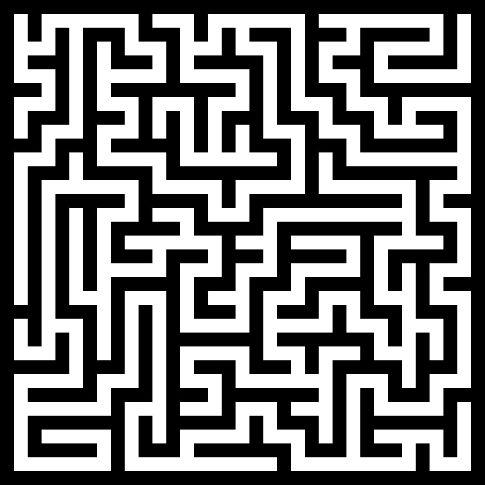
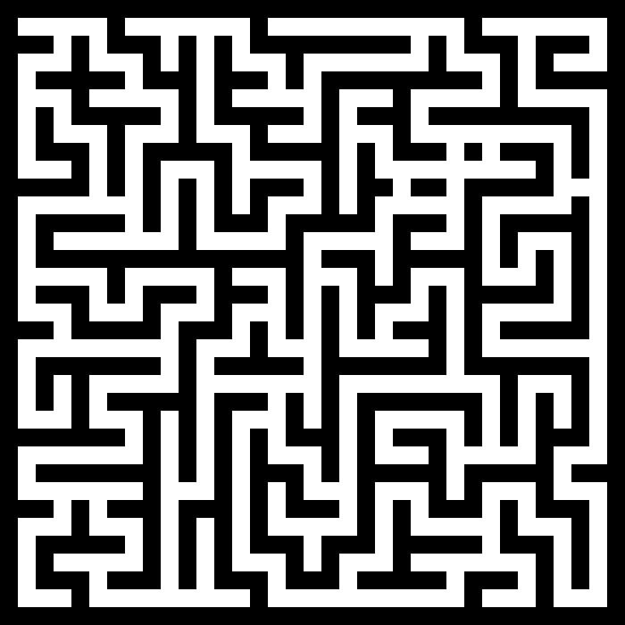
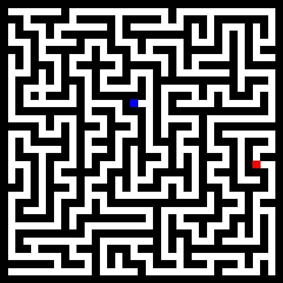
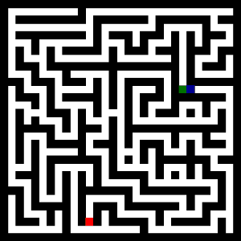
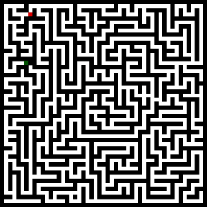
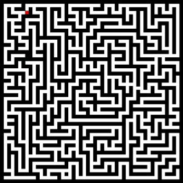
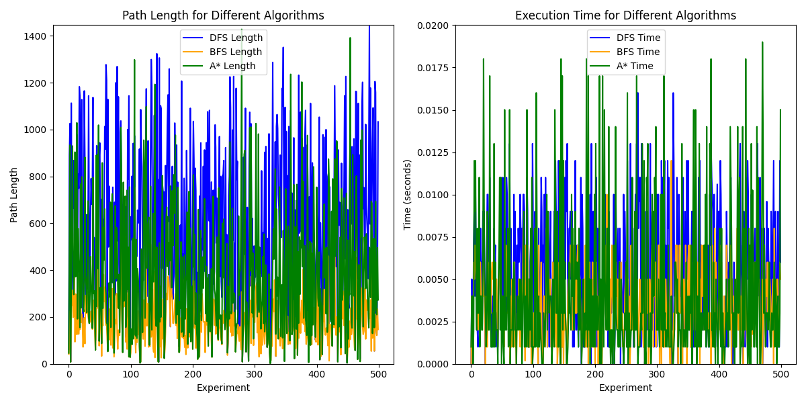
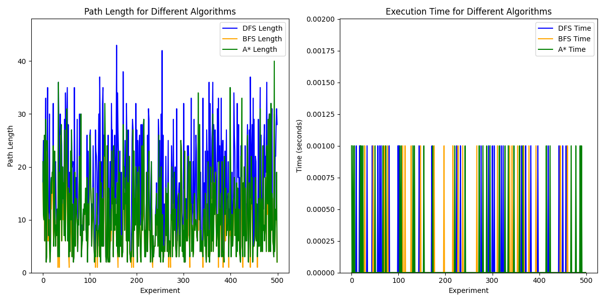

___
# Информация
В данной работе на языке Python был реализован алгоритм создания лабиринтов, а также три алгоритма обхода лабиринта - DFS, BFS и A*. При помощи библиотеки [Pillow](https://dvmn.org/encyclopedia/modules/pillow/) лабиринт и обходы были визуализированы. При помощи библиотек [MatPlotLib](https://matplotlib.org/) и [Pandas](https://pandas.pydata.org/) были построены графики для сравнения этих алгоритмов. 
___
# Лабиринт
Для построения лабиринта был использован алгоритм Recursive Backtracker, по своей сути это обход в глубину, но в матрице. <p> 
1. Случайным образом выбирается начальная точка и добавляется в стек
2. Цикл, пока стек не пустой
    * Достаём из стека клетку и считаем её текущей
    * Если среди смежных с ней клеток имеются непосещённые
        * Отправляем текущую клетку в стек
        * Выбираем случайную смежную клетку
        * Отмечаем клетку посещённой и убираем её в стек

Данный алгоритм создает лабиринт без циклов, а значит путь от начальной до конечной точки существует только один. Более подробно про этот алгоритм можно почитать в [статье](https://habr.com/ru/articles/778202/) на хабре.

[1]: Функция start_point возвращает кортеж с координатами начальной точки
```
def start_point(M: int, N: int) -> tuple:
    if random.choice([True, False]):
        if random.choice([True, False]):
            start = (M - 1, random.choice([i for i in range(1, N - 1)]))
        else:
            start = (0, random.choice([i for i in range(1, N - 1)]))

    else:
        if random.choice([True, False]):
            start = (random.choice([i for i in range(0, M)]), 0)
        else:
            start = (random.choice([i for i in range(0, M)]), N - 1)

    return start
```

[2]: Функция choice_transition возвращает кортеж из координат следующей клетки (для  матрицы достижимости и матрицы переходов). Параметры mode и finish будут нужны позже для реализации алгоритмов.

```
def choice_transition(x: int, y: int, rm: np.ndarray, mode: str, finish = (-1, 1)) -> tuple:
    choice_list = []

    if mode == "create":
        if x > 0:
            if not rm[x - 1][y]:
                choice_list.append((x - 1, y))
        if x < len(rm) - 1:
            if not rm[x + 1][y]:
                choice_list.append((x + 1, y))
        if y > 0:
            if not rm[x][y - 1]:
                choice_list.append((x, y - 1))
        if y < len(rm[0]) - 1:
            if not rm[x][y + 1]:
                choice_list.append((x, y + 1))

    if choice_list:
        nx, ny = random.choice(choice_list)
        if x == nx:
            if ny > y:
                tx, ty = x * 2, ny * 2 - 1
            else:
                tx, ty = x * 2, ny * 2 + 1
        else:
            if nx > x:
                tx, ty = nx * 2 - 1, y * 2
            else:
                tx, ty = nx * 2 + 1, y * 2
        return (nx, ny, tx, ty)
    else:
        return (-1, -1, -1, -1)
```

[3]: Функция  create_labyrinth создаёт матрицу лабиринта. Параметр count_door будет нужен для создания лабиринтов с циклами.

```
def create_labyrinth(M: int, N: int, count_door: int) -> np.ndarray:

    labyrinth = np.zeros((M*2-1, N*2-1))
    for i in range(M*2-1):
        for j in range(N*2-1):
            if ((i % 2 == 0) and (j % 2 == 0)):
                labyrinth[i][j] = 1

    rm = np.zeros((M, N))
    start = start_point(M, N)
    x, y = start
    rm[x][y] = 1
    list_transition = [start]
    x, y, tx, ty = choice_transition(x, y, rm, "create")
    for _ in range(1, M*N):

        while not (x >= 0 and y >= 0):
            x, y = list_transition[-1]
            list_transition.pop()
            x, y, tx, ty = choice_transition(x, y, rm, "create")
        rm[x][y] = 1
        list_transition.append((x, y))
        labyrinth[tx][ty] = 1

        x, y, tx, ty = choice_transition(x, y, rm, "create")

    return labyrinth
```

 При помощи библиотеки Pillow можно нарисовать лабиринт и получится что-то подобное. 



Чтобы добавить в лабиринт циклы можно случайным образом убирать стены, у которых 2 смежные противоположные стороны одного цвета, а другие 2 смежные стороны другого. Этот кусок кода добавляется в функцию create_labyrinth

```
    while count_door != 0:
        x = random.randint(1, M*2-3)
        y = random.randint(1, N*2-3)
        if (labyrinth[x-1][y] == 1 and labyrinth[x+1][y] == 1):
            if (labyrinth[x][y-1] == 0 and  labyrinth[x][y+1]==0):
                labyrinth[x][y] = 1
                count_door -= 1
                continue
        elif (labyrinth[x][y - 1] == 1 and labyrinth[x][y + 1] == 1):
            if (labyrinth[x-1][y] == 0 and labyrinth[x+1][y] == 0):
                labyrinth[x][y] = 1
                count_door -= 1
```
Тогда мы получим следующее:



Остаётся только добавить начальную и конечную точку.

[4]: Функция start_finish
```
def start_finish(labyrinth: np.ndarray) -> tuple:
    while True:
        xs, ys, xf, yf = random.randint(1, labyrinth.shape[0]-1), random.randint(1, labyrinth.shape[1]-1),\
            random.randint(1, labyrinth.shape[0]-1), random.randint(1, labyrinth.shape[1]-1)
        if labyrinth[xs][ys] == 1 and labyrinth[xf][yf] == 1:
            return (xs, ys, xf, yf)
```



___
# DFS
Для  реализации обхода в глубину в choice_transition добавим код. (Это нужно только для того, чтобы в будущем красиво визуализировать обход).

```
    ...
                 choice_list.append((x, y + 1))


    if mode == "DFS" or mode == "AStar" or mode == "BFS":
        if x > 0:
            if rm[x - 1][y] == 1 or rm[x - 1][y] == 3:
                choice_list.append((x - 1, y))
        if x < len(rm) - 1:
            if rm[x + 1][y] == 1 or rm[x + 1][y] == 3:
                choice_list.append((x + 1, y))
        if y > 0:
            if rm[x][y - 1] == 1 or rm[x][y-1] == 3:
                choice_list.append((x, y - 1))
        if y < len(rm[0]) - 1:
            if rm[x][y + 1] == 1 or rm[x][y+1] == 3:
                choice_list.append((x, y + 1))*


    if choice_list:
    ...

```

Сама функции обхода выглядит вот так:
```
def DFS4Lab(labyrinth: np.ndarray, start: tuple, finish: tuple, mode: str) -> None:
    labyrinth = labyrinth.copy()
    #count = 0

    x_start, y_start = start
    x_finish, y_finish = finish
    labyrinth[x_start][y_start] = 2
    labyrinth[x_finish][y_finish] = 3

    way = [(x_start, y_start)]
    x, y = way[-1]
    x, y, _, __ = choice_transition(x, y, labyrinth, mode, finish)

    while True:
        #count += 1
        while not (x >= 0 and y >= 0):
            way.pop()
            x, y = way[-1]
            x, y, _, __ = choice_transition(x, y, labyrinth, mode, finish)

        way.append((x, y))
        if labyrinth[x][y] == 3:
            break
        labyrinth[x][y] = 4
        x, y, _, __ = choice_transition(x, y, labyrinth, mode, finish)


        #draw_lab(labyrinth, f"/Ваш путь/{count}.png")
    #for point in way[1:len(way)-1]:
        #x, y = point[0], point[1]
        #labyrinth[x][y] = 5
    #draw_lab(labyrinth, f"/Ваш путь/{count}.png")

```
[5]: Аргумент mode принимает значение или "DFS", или "AStar". Это связано с тем, что AStar, рассматриваемый в этом  проекте будет похож на DFS, но главное различие в  способе выбора следующей клетки. Закомментированные строки нужны для визуализации алгоритма. На каждом шаге в выбранную папку будет сохраняться изображение с шагом алгоритма.

Пример работы DFS


___

# AStar
Эврестический алгоритм, в котором порядок обхода определяется какой-либо функцией. В данной работе в качестве метрики для определения следующей клетки было использовано евклидово расстояние между следующей клеткой и финишем. Приоритет отдается клетке с наименьшим расстоянием. Более подробно про A* можно почитать на [wiki](https://ru.wikipedia.org/wiki/A*#:~:text=A%20star)

Для его реализации необходимо в функцию choice_transition добавить следующий блок кода:

```
...
                choice_list.append((x, y + 1))


    if choice_list:
        great_choice = []
        x_finish, y_finish = finish
        if mode == "AStar":
            for i in range(len(choice_list)):
                dx, dy = choice_list[i]
                dist = np.sqrt((dx-x_finish)**2+(dy-y_finish)**2)
                great_choice.append([(dx, dy), dist])
            great_choice.sort(key=lambda x: x[1])
            nx, ny = great_choice[0][0]


        else:
            nx, ny = random.choice(choice_list)
...
```
Пример работы A*




Особенно хорошо он справляется с сильно разреженными лабиринтами (но не всегда)
___
# BFS
Главное отличие BFS от прошлых обходов в том, что он позволяет находить наилучший путь из всех возможных (либо один из лучших, если таких несколько).

Для его реализации нужно снова изменить функцию choice_transition, по итогу она будет выглядеть так:

```
def choice_transition(x: int, y: int, rm: np.ndarray, mode: str, finish = (-1, 1)) -> tuple:
    choice_list = []

    if mode == "create":
        if x > 0:
            if not rm[x - 1][y]:
                choice_list.append((x - 1, y))
        if x < len(rm) - 1:
            if not rm[x + 1][y]:
                choice_list.append((x + 1, y))
        if y > 0:
            if not rm[x][y - 1]:
                choice_list.append((x, y - 1))
        if y < len(rm[0]) - 1:
            if not rm[x][y + 1]:
                choice_list.append((x, y + 1))

    if mode == "DFS" or mode == "AStar" or mode == "BFS":
        if x > 0:
            if rm[x - 1][y] == 1 or rm[x - 1][y] == 3:
                choice_list.append((x - 1, y))
        if x < len(rm) - 1:
            if rm[x + 1][y] == 1 or rm[x + 1][y] == 3:
                choice_list.append((x + 1, y))
        if y > 0:
            if rm[x][y - 1] == 1 or rm[x][y-1] == 3:
                choice_list.append((x, y - 1))
        if y < len(rm[0]) - 1:
            if rm[x][y + 1] == 1 or rm[x][y+1] == 3:
                choice_list.append((x, y + 1))

    if choice_list:
        great_choice = []
        x_finish, y_finish = finish
        if mode == "AStar":
            for i in range(len(choice_list)):
                dx, dy = choice_list[i]
                dist = np.sqrt((dx-x_finish)**2+(dy-y_finish)**2)
                great_choice.append([(dx, dy), dist])
            great_choice.sort(key=lambda x: x[1])
            nx, ny = great_choice[0][0]

        elif mode == "BFS":
            return (x, y, choice_list)

        else:
            nx, ny = random.choice(choice_list)

        if x == nx:
            if ny > y:
                tx, ty = x * 2, ny * 2 - 1
            else:
                tx, ty = x * 2, ny * 2 + 1
        else:
            if nx > x:
                tx, ty = nx * 2 - 1, y * 2
            else:
                tx, ty = nx * 2 + 1, y * 2
        return (nx, ny, tx, ty)

    else:
        if mode == "BFS":
            return (-1, -1, [-1, -1])
        return (-1, -1, -1, -1)
```
Опять же, по большей части это нужно именно для красивой  визуализации алгоритма.

Сам же  алгоритм выглядит так:

[6]: Путь от начальной до конечной точки содержится в списке path
```
def BFS4Lab(labyrinth: np.ndarray, start: tuple, finish: tuple, mode="BFS") -> None:
    labyrinth = labyrinth.copy()
    queue = [start]
    parent = {}
    #count = 0
    x_start, y_start = start
    x_finish, y_finish = finish
    labyrinth[x_start][y_start] = 2
    labyrinth[x_finish][y_finish] = 3

    while queue:

        curr = queue.pop(0)
        x, y = curr
        if curr == finish:
            break
        x, y, choice = choice_transition(x, y, labyrinth, mode, finish)

        if x >= 0 and y >= 0:
            for nx, ny in choice:
                queue.append((nx, ny))
                if labyrinth[nx][ny] != 3:
                    labyrinth[nx][ny] = 4
                parent[(nx, ny)] = (x, y)

                #draw_lab(labyrinth, f"C:/Users/timof/Desktop/Progs/Labirint/{mode}/{count}.png")
                #count += 1

    #Определение пути
    path = []
    curr = finish
    while curr in parent:
        path.append(curr)
        curr = parent[curr]
    path.reverse()

    #Визуализация пути
    #for point in path[:len(path)-1]:
        #x, y = point[0], point[1]
        #labyrinth[x][y] = 5
    #draw_lab(labyrinth, f"/Ваш путь/{count}.png")

```

Пример работы BFS:




___
# Функция для рисования лабиринтов:
```
def draw_lab(labyrinth: np.ndarray, path: str) -> None:
    labyrinth = np.pad(labyrinth, pad_width=1, constant_values=0)

    cell_size = 15
    width = labyrinth.shape[1] * cell_size
    height = labyrinth.shape[0] * cell_size

    image = Image.new('RGB', (width, height), 'white')
    draw = ImageDraw.Draw(image)

    for i in range(labyrinth.shape[0]):
        for j in range(labyrinth.shape[1]):
            if labyrinth[i][j] == 0: #BLOCK
                draw.rectangle([j * cell_size, i * cell_size,
                                (j + 1) * cell_size, (i + 1) * cell_size],
                               fill='black')
            elif labyrinth[i][j] == 2: #START
                draw.rectangle([j * cell_size, i * cell_size,
                                (j + 1) * cell_size, (i + 1) * cell_size],
                               fill='blue')
            elif labyrinth[i][j] == 3: #FINISH
                draw.rectangle([j * cell_size, i * cell_size,
                                (j + 1) * cell_size, (i + 1) * cell_size],
                               fill='red')
            elif labyrinth[i][j] == 4: #SEARCH
                draw.rectangle([j * cell_size, i * cell_size,
                                (j + 1) * cell_size, (i + 1) * cell_size],
                               fill='green')
            elif labyrinth[i][j] == 5: #WAY
                draw.rectangle([j * cell_size, i * cell_size,
                                (j + 1) * cell_size, (i + 1) * cell_size],
                               fill='yellow')
    image.save(f"{path}")
```

___
# Сравнение и графики
Я сделал 500 запусков алгоритмов, каждый раз генерируя новый лабиринт. На каждой итерации я сохранял затраченное время и длину пути, который нашел алгоритм.

Для лабиринта размером 79x79 он выглядит следующим образом:

<div style="text-align: center;">
    Графики длины и времени для лабиринта 79x79
</div>



Ожидаемо, что самые короткие пути находил BFS, так же можно увидеть, что в среднем A* находил более короткие пути, чем DFS. 

Если говорить о времени, то можно сказать, что самым долгим оказался DFS, однако были  лабиринты, в которых A* справлялся дольше.

Средняя длина пути для алгоритмов:
* DFS - 603
* AStar - 390
* BFS - 177

Похожая картина наблюдается и для лабиринтов поменьше

<div style="text-align: center;">
    Графики длины и времени для лабиринта 9x9
</div>



С длинами путей всё остаётся по-прежнему, а затраченное время настолько мало, что нет смысла его сравнивать.

Средние длины пути для алгоритмов:
* DFS - 16
* AStar - 10
* BFS - 9
___
# Итог
Наиболее эффектинвым оказался обход в ширину (BFS), самым неэффективным обход в глубину (DFS), но при помощи добавления функции выбора клетки получилось сократить путь почти в 2 раза (A*). Также, для лабиринтов небольшого размера длины путей BFS и AStar практически не отличаются 

### Полный код, а также графики и гифки лежат в репозитории
___
